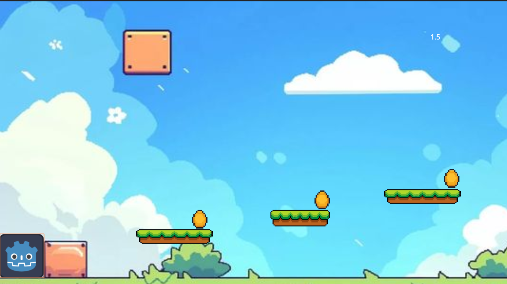

# MatsIOware
A warioware style game, I made using a guide from hackclub.

## Try it
You can try the game here, on itch.io: https://movermans.itch.io/matsioware

## Quickstart
Just open the link above, or in the releases tab. A start game button will be visible on itch.io

## Features:

- Uses godot
- Platformer game
- Clicker game.
- Custom title-, death- and winscreen.

## How it works

The game uses godots 2D interface for the scenes, and gdScript for the underlying logic. 

## Credits

Memes used on the death- and winscreen are pretty common memes I got from pinterest. Backgrounds are also from pintrest, they were quite heavily reposted so I was not able to find the original creator. The golden eggs I found on a random USB drive, I think I drew them myself. The platformer uses the godot icon, bc I think he is cute.

**If you think I used your copyright without your consent/outside your license, please contact me:** mats@overmans.nl